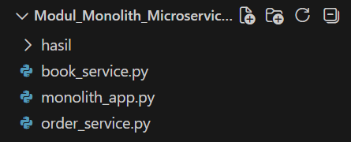
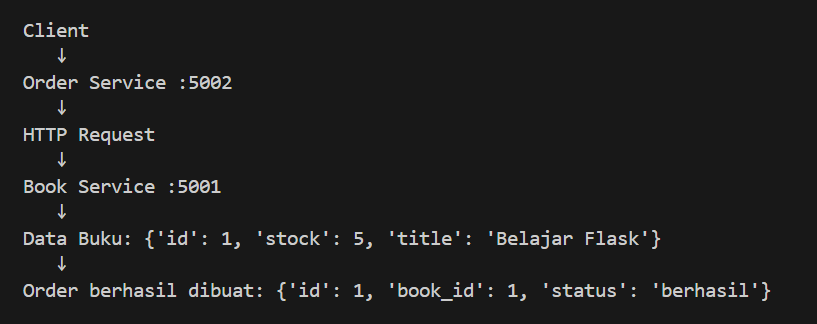
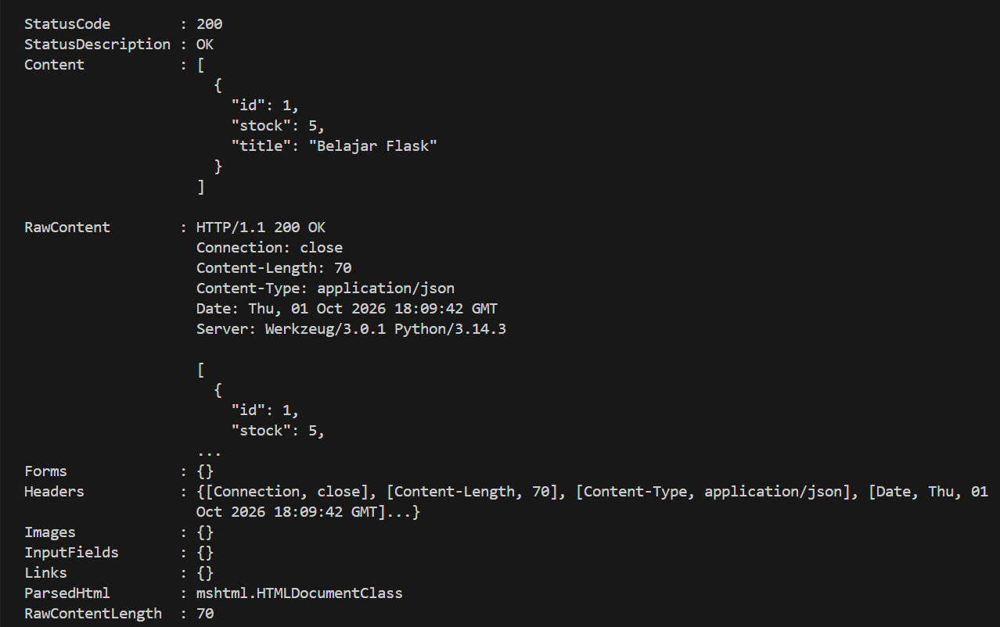
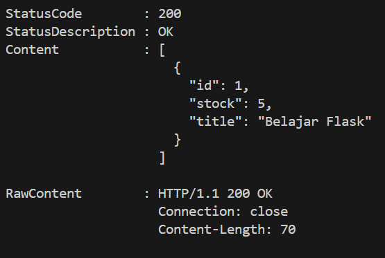
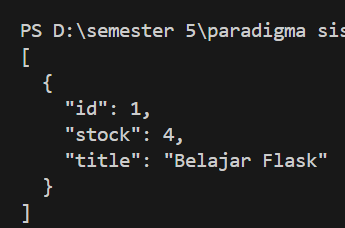
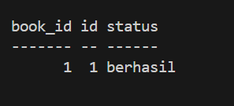
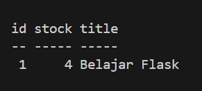
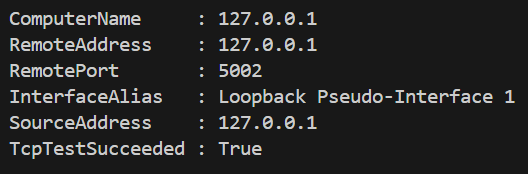
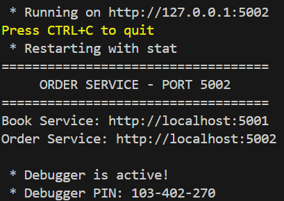

<div align="center">

# Hands-on-Monolith_vs_Microservices


### LAPORAN PRAKTIKUM PARADIGMA SISTEM

<br>

**Disusun Oleh:**
| | | |
|:--|:-:|:--|
| Nama | : | Mulkan Azhima |
| NIM | : | 2024903430073 |
| Kelas | : | TRKJ-3C |

<br>

### Program Studi Teknologi Rekayasa Komputer Jaringan
### Jurusan Teknologi Informasi dan Komputer
### Politeknik Negeri Lhokseumawe
### 2026

</div>

---

## Daftar Isi

- [A. Tujuan Praktikum](#a-tujuan-praktikum)
- [B. Dasar Teori](#b-dasar-teori)
- [C. Alat dan Bahan](#c-alat-dan-bahan)
- [D. Arsitektur dan Alur Sistem](#d-arsitektur-dan-alur-sistem)
- [E. Langkah Kerja dan Hasil](#e-langkah-kerja-dan-hasil)
- [F. Pembahasan: Monolith vs Microservices](#f-pembahasan-monolith-vs-microservices)
- [G. Kesimpulan](#g-kesimpulan)
- [H. Referensi](#h-referensi)

---

## A. Tujuan Praktikum

1. Memahami perbedaan arsitektur **Monolith** dan **Microservices**.
2. Membangun dua layanan terpisah (**Book Service** dan **Order Service**) menggunakan Flask.
3. Memahami komunikasi antar layanan melalui **HTTP Request**.
4. Menguji ketersediaan layanan dan setiap endpoint menggunakan PowerShell.
5. Membuktikan bahwa data antar layanan tetap konsisten (stok buku berkurang setelah order dibuat).

## B. Dasar Teori

**Monolith** adalah arsitektur di mana seluruh fitur aplikasi (misalnya buku, pesanan, dan pengguna) digabung dalam satu kode dan satu proses. Arsitektur ini sederhana untuk dikembangkan dan di-*deploy*, tetapi sulit dikembangkan dan di-*scale* ketika aplikasi semakin besar karena satu kesalahan dapat memengaruhi seluruh sistem.

**Microservices** adalah arsitektur di mana aplikasi dipecah menjadi beberapa layanan kecil yang berdiri sendiri. Setiap layanan memiliki tanggung jawab, port, dan data masing-masing, serta berkomunikasi dengan layanan lain melalui protokol ringan seperti HTTP/REST. Keuntungannya adalah layanan dapat dikembangkan, di-*deploy*, dan di-*scale* secara independen.

Pada praktikum ini diterapkan pendekatan microservices dengan dua layanan:

| Layanan | Port | Tanggung Jawab |
|:--|:-:|:--|
| Book Service | 5001 | Menyimpan dan menyediakan data buku serta stok |
| Order Service | 5002 | Menerima pesanan dan memanggil Book Service |

## C. Alat dan Bahan

- Laptop/PC
- Windows + PowerShell
- Python 3 & Flask
- Visual Studio Code
- Library `requests` (komunikasi HTTP antar layanan)

## D. Arsitektur dan Alur Sistem

Alur komunikasi antar layanan ditunjukkan pada gambar berikut.




**Penjelasan:**
1. **Client** mengirim permintaan pembuatan pesanan ke **Order Service** pada port `5002`.
2. **Order Service** mengirim **HTTP Request** ke **Book Service** pada port `5001` untuk mengambil data buku.
3. **Book Service** mengembalikan data buku: `{'id': 1, 'stock': 5, 'title': 'Belajar Flask'}`.
4. **Order Service** membuat pesanan dan mengembalikan hasil: `{'id': 1, 'book_id': 1, 'status': 'berhasil'}`.

Dengan pola ini, Order Service tidak mengakses data buku secara langsung, melainkan melalui API milik Book Service. Inilah ciri utama arsitektur microservices.

## E. Langkah Kerja dan Hasil

### 1. Menguji koneksi ke Order Service

Sebelum pengujian, dipastikan Order Service sudah berjalan dan dapat dijangkau pada port 5002 menggunakan `Test-NetConnection`.

```powershell
Test-NetConnection -ComputerName 127.0.0.1 -Port 5002
```



**Penjelasan:** Hasil `TcpTestSucceeded : True` menunjukkan port `5002` terbuka dan Order Service aktif menerima koneksi pada alamat `127.0.0.1` (loopback).

---

### 2. Mengecek stok awal buku (Book Service)

Dilakukan permintaan **GET** ke Book Service untuk melihat data buku sebelum pesanan dibuat.

```powershell
Invoke-WebRequest -Uri http://127.0.0.1:5001/books
```



**Penjelasan:** Book Service merespons dengan `StatusCode 200 OK`. Data buku yang diterima adalah `id: 1`, `title: "Belajar Flask"`, dan `stock: 5`.

Detail response lengkap, termasuk *header*, terlihat pada gambar berikut.



**Penjelasan:** `RawContent` menampilkan `HTTP/1.1 200 OK` dengan `Connection: close` dan `Content-Length: 70`. Ini membuktikan Book Service berjalan normal dan mengembalikan data dalam format JSON.

---

### 3. Membuat pesanan (Order Service)

Dilakukan permintaan **POST** ke Order Service untuk membuat pesanan buku dengan `book_id = 1`.

```powershell
Invoke-RestMethod -Uri http://127.0.0.1:5002/orders -Method POST `
  -ContentType "application/json" -Body '{"book_id": 1}'
```



**Penjelasan:** Order Service berhasil membuat pesanan. Hasilnya memuat `id = 1`, `book_id = 1`, dan `status = berhasil`.

Hasil pesanan dapat dilihat juga pada pengujian berikutnya.



**Penjelasan:** Output yang sama muncul sesuai alur sistem, yaitu Order Service berhasil menghubungi Book Service dan menyimpan pesanan dengan status `berhasil`.

---

### 4. Mengecek stok buku setelah pesanan

Setelah pesanan dibuat, data buku dicek kembali ke Book Service.

```powershell
Invoke-RestMethod -Uri http://127.0.0.1:5001/books
```


**Penjelasan:** Stok buku "Belajar Flask" berkurang dari **5** menjadi **4**. Hal ini membuktikan bahwa Order Service berhasil berkomunikasi dengan Book Service dan memperbarui stok.

---

### Ringkasan Hasil

| No | Pengujian | Hasil |
|:-:|:--|:--|
| 1 | Koneksi ke Order Service (port 5002) | `TcpTestSucceeded : True` |
| 2 | GET data buku (stok awal) | `200 OK`, stok = 5 |
| 3 | POST pesanan buku id 1 | Status `berhasil` |
| 4 | GET data buku (setelah pesanan) | Stok = 4 |

## F. Pembahasan: Monolith vs Microservices

| Aspek | Monolith | Microservices |
|:--|:--|:--|
| Struktur | Satu aplikasi utuh | Beberapa layanan terpisah (5001 dan 5002) |
| Komunikasi | Pemanggilan fungsi langsung dalam satu proses | HTTP Request antar layanan |
| Deployment | Seluruh aplikasi di-*deploy* bersamaan | Tiap layanan dapat di-*deploy* sendiri |
| Skalabilitas | Seluruh aplikasi harus di-*scale* | Hanya layanan yang dibutuhkan yang di-*scale* |
| Ketahanan | Satu error dapat menjatuhkan seluruh sistem | Kegagalan satu layanan dapat dibatasi |
| Kompleksitas | Lebih sederhana | Lebih kompleks (jaringan, port, konsistensi data) |

Pada praktikum ini terlihat bahwa Order Service bergantung pada Book Service. Jika Book Service mati, pesanan tidak dapat dibuat. Hal ini menunjukkan bahwa microservices membutuhkan penanganan komunikasi antar layanan yang baik, namun memberi fleksibilitas karena kedua layanan dapat dikembangkan dan dijalankan secara mandiri.

## G. Kesimpulan

Praktikum ini berhasil memperlihatkan perbedaan arsitektur monolith dan microservices melalui dua layanan Flask, yaitu **Book Service (port 5001)** dan **Order Service (port 5002)**. Pengujian menunjukkan koneksi antar layanan berjalan baik, pesanan berhasil dibuat, dan stok buku berkurang dari 5 menjadi 4. Arsitektur microservices memberikan pemisahan tanggung jawab yang jelas dan memudahkan pengembangan secara independen, tetapi menuntut komunikasi antar layanan yang andal.


## H. Referensi

1. Flask. (2026). *Flask Documentation*. https://flask.palletsprojects.com
2. Fowler, M. & Lewis, J. (2014). *Microservices: a definition of this new architectural term*. https://martinfowler.com/articles/microservices.html
3. Microsoft. (2026). *Invoke-RestMethod and Invoke-WebRequest*. https://learn.microsoft.com/powershell
